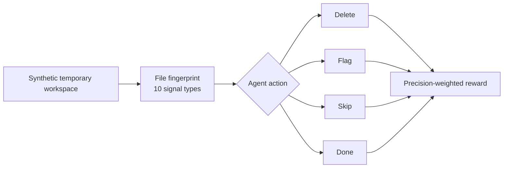

# AI Digital Bloat Detector

> **Meta  Scaler Hackathon**  "AI-Generated Digital Bloat" Track

An RL environment that trains an agent to forensically scan a developer workspace,
identify AI-generated bloat, and delete it  earning rewards for precision and
recall, with heavy penalties for destroying real human work.


## Evidence at a glance

| Verified from the tracked code | Count |
| --- | ---: |
| Forensic signal types | **10** |
| Agent actions: delete, flag, skip, done | **4** |
| Synthetic labeled cases | **16** |
| Evaluation task definitions | **4** |
| FastAPI endpoints | **4** |

## Preview

No reviewed agent-run screenshot is published because filesystem paths may
contain private workspace information. The GitHub-rendered flow below is the
safe repository preview.

## Architecture



> **Safety and evidence:** the environment is intended to operate only on its
> generated temporary workspace. Audit path and symlink boundaries before using
> any real files. Values returned by the root `tasks.py` grader are fixed
> placeholders, not measured model performance.

## Environment Variables

| Variable | Required | Default | Description |
|---|---|---|---|
| `HF_TOKEN` | ✅ on HF Spaces (auto-injected) | — | HuggingFace token — used as the API key for the HF Router API |
| `OPENAI_API_KEY` | Alternative to `HF_TOKEN` | — | OpenAI key (use when pointing `API_BASE_URL` at OpenAI) |
| `API_BASE_URL` | No | `https://router.huggingface.co/v1` (HF) / `https://api.openai.com/v1` (OpenAI) | LLM endpoint (any OpenAI-compatible API) |
| `MODEL_NAME` | No | `Qwen/Qwen2.5-72B-Instruct` (HF) / `gpt-4o-mini` (OpenAI) | Model identifier |
| `ENV_URL` | No | `http://localhost:8000` | URL used by `inference.py` for the running environment server |

> **HF Spaces**: `HF_TOKEN` is injected automatically — no secrets to configure.

## What it does

Modern AI coding agents (Cursor, GitHub Copilot, Claude Code, etc.) leave
behind a trail of digital waste:

| Bloat Type | Example | Typical Size |
|---|---|---|
| Hidden agent configs | `.cursorrules`, `.claude/` | KBs |
| Dependency trees | `node_modules/`, `venv/` | 100s of MBs |
| Build caches | `__pycache__/`, `.pytest_cache/` | MBs |
| Batch-scaffolded boilerplate | `utils.py`, `services.py`, `helpers.py` (all same mtime) | KBs |
| Disguised binaries | `secret.png` with Python content | KBs |
| Duplicate drafts | `temp_draft_v1.py` == `temp_draft_v1_copy.py` | KBs |

## Quick Start

```bash
git clone https://github.com/Sriman-Kunda-056/Ai_Bloat_Cleaner.git
cd Ai_Bloat_Cleaner
uv sync --frozen
uv run uvicorn server.app:app --reload

# In another terminal
uv run python inference.py
```

## Action Space

| `action_type` | Effect | Reward |
|---|---|---|
| `"delete"` | Remove item from disk | +1.00 (TP) / **-2.00 (FP)** |
| `"flag"` | Mark for human review | +0.40 (TP) / -0.40 (FP) |
| `"skip"` | Keep the item | +0.30 (TN) / -0.30 (FN) |
| `"done"` | End episode early | 0.00 + F1 bonus |

Terminal bonus: `+3.0  F1` applied at episode end.

## Observation: FileFingerprint

Each step the agent receives a `FileFingerprint` with:

```
path               relative path within the workspace
is_directory       True for directory items
size_bytes         file size (or total subtree size for dirs)
ctime/mtime/atime  filesystem timestamps
sha256_hash        content hash (files only)
magic_header       first 16 bytes in hex (for type verification)
declared_type      type inferred from extension
detected_type      type inferred from magic bytes
type_mismatch      True when extension contradicts content
ai_signals         list of AISignal objects with confidence scores
ai_probability     composite AI-generation probability [0, 1]
```

### AI Signals

| Signal | Description |
|---|---|
| `HIDDEN_ARTIFACT_DIR` | `.cursorrules`, `.claude/`, `.cursor/` |
| `DEPENDENCY_BLOAT` | `node_modules/`, `venv/` |
| `BUILD_CACHE` | `__pycache__/`, `.pytest_cache/` |
| `BATCH_CREATION` | 3 files sharing the same modification timestamp |
| `DUPLICATE_CONTENT` | Identical SHA-256 across multiple files |
| `TEMP_DRAFT` | Filename contains `temp_`, `draft_`, `_copy`, `.bak` |
| `BYTECODE_ARTIFACT` | `.pyc` files |
| `VIRTUALENV_INTERNAL` | `pyvenv.cfg` manifest |
| `TYPE_MISMATCH` | Extension says image/binary but magic bytes say text |
| `AI_SCAFFOLD_NAME` | `utils.py`, `services.py`, `helpers.py` etc. |

## Synthetic Workspace

Each `reset()` creates a fresh temp directory with **ground-truth labels**:

```
workspace/
 .cursorrules               AI bloat (agent config)
 .claude/settings.json      AI bloat (agent config)
 .github/prompts/...        AI bloat (Copilot prompts)
 node_modules/              AI bloat (dependency tree)
 __pycache__/               AI bloat (bytecode cache)
 venv/pyvenv.cfg            AI bloat (virtual env)
 src/utils.py               AI bloat (batch scaffold, same mtime)
 src/services.py            AI bloat (batch scaffold)
 src/controllers.py         AI bloat (batch scaffold)
 src/helpers.py             AI bloat (batch scaffold)
 temp_draft_v1.py           AI bloat (temp file)
 temp_draft_v1_copy.py      AI bloat (duplicate)
 assets/secret.png          AI bloat (TYPE_MISMATCH: Python in .png)
 README.md                  HUMAN (30 days old)
 notes.txt                  HUMAN (7 days old)
 requirements.txt           HUMAN (5 days old, 2 packages)
```

Items are shuffled on each reset so the agent cannot exploit order.

## Building & Running

```bash
# Build Docker image
docker build -t ai-bloat-detector .

# Run server
docker run -p 8000:8000 ai-bloat-detector

# Or locally with uvicorn
uvicorn server.app:app --reload
```

## Repository layout

```
Ai_Bloat_Cleaner/
├── models.py                  # Action, observation, fingerprint models
├── client.py                  # Environment client
├── inference.py               # Example policy/inference loop
├── openenv.yaml               # OpenEnv manifest
├── pyproject.toml             # Package metadata
├── server/
│   ├── app.py                 # FastAPI server
│   ├── environment.py         # Environment lifecycle
│   ├── triage_env.py          # Filesystem triage environment
│   └── reward.py              # Reward calculation
└── tasks/                     # Task definitions and graders
```

## Tests and validation

The repository includes two executable endpoint smoke scripts:

```bash
uv run python test_default_action.py
uv run python test_endpoints.py
```

They exercise reset, step, state, and default-action behavior, but print results
instead of asserting them. They are smoke checks, not a measured RL benchmark or
a complete automated regression suite.

## Limitations

- The labeled workspace is synthetic and does not represent the full variety of
  real developer repositories.
- Deleting files outside the generated temporary workspace has not been reviewed
  as safe and can destroy human work.
- The fixed root-grader values are placeholders, not trained-agent performance.
- Filesystem permissions, symlinks, race conditions, and adversarial paths need
  additional hardening before any real cleanup use.

## Numbered commit history

1. `Initial` - import the original OpenEnv prototype.
2. `01` - document verified signals, actions, safety boundaries, and structure.
3. `02` - standardize the evidence-first GitHub README format.

## Suggested GitHub topics

`reinforcement-learning` `openenv` `ai-safety` `filesystem`
`digital-forensics` `fastapi` `pydantic` `ai-agents`

## License and attribution

No repository-wide license file is included. OpenEnv, FastAPI, Pydantic, and
other dependencies remain subject to their respective licenses.
